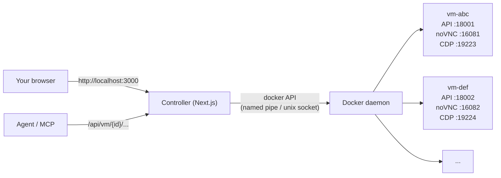
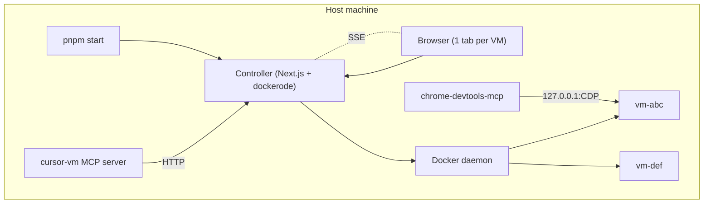

# Cursor-style VM (multi-VM controller)

A local sandbox that mirrors what you see when you open the remote desktop of
a Cursor cloud agent: a clean Ubuntu 24.04 + XFCE desktop with Thunar and a
dock, accessible from your browser via noVNC, and a small HTTP automation
API so any external script or LLM can drive it.

**One service to start, N VMs side by side.** Each VM runs in its own Docker
container, with its own persistent volume, its own loopback ports for API /
noVNC / CDP, and its own tab in the web console.



## Requirements

- Docker Desktop with the WSL2 backend (Windows) or any Docker engine on
  Linux/macOS.
- Node.js ≥ 20 + pnpm.
- ~6 GB free disk for the VM image, ~2 GB RAM per running VM by default.

## Quick start

```bash
cd controller
pnpm install
pnpm start
```

The controller boots, validates env, builds the VM image automatically if it
isn't present locally (first run only — that part takes a while), then opens
on <http://localhost:3000>. From there:

1. Click **New VM** → a fresh container spins up; the noVNC desktop appears
   in the first tab.
2. Click **New VM** again → a second VM in a second tab, fully isolated from
   the first.
3. Use the dock to take screenshots, open the integrated shell, restart the
   desktop session, etc.
4. Hover a tab to delete or hard-reset that VM.

To stop the controller: `Ctrl+C`. Running VM containers survive a controller
restart and are rehydrated automatically on the next boot (Docker is the
source of truth, the controller is stateless).

## What's inside each VM

| Layer | Tool |
| --- | --- |
| OS | Ubuntu 24.04 |
| Display server | Xvfb (`:1`, `1920x1080x24` by default) |
| Desktop | XFCE 4 (xfwm, xfdesktop, xfce4-panel, Thunar, Plank) |
| VNC server | x11vnc on container port 5901 |
| Web client | noVNC + websockify on container port 6080 |
| Apps | Google Chrome (with managed policies) — install more on demand |
| Automation | FastAPI + xdotool + scrot on container port 8000 |
| CDP forward | `socat` to expose Chrome DevTools on container port 9222 |

The controller publishes those container ports on **dynamic loopback host
ports** (defaults: API 18000+, noVNC 16080+, CDP 19222+). They are never
bound on `0.0.0.0`, so VMs can't be reached from off-host.

## Driving a VM from outside

Each VM is reachable from the host via the controller proxy:

```bash
# 1. List VMs
curl http://localhost:3000/api/vms

# 2. Take a screenshot of vm `abc`
curl -o screen.png http://localhost:3000/api/vm/abc/screenshot

# 3. Click at (960, 540) in vm `abc`
curl -X POST http://localhost:3000/api/vm/abc/click \
     -H 'content-type: application/json' \
     -d '{"x": 960, "y": 540}'

# 4. Run a shell command in vm `abc`
curl -X POST http://localhost:3000/api/vm/abc/shell \
     -H 'content-type: application/json' \
     -d '{"cmd": "apt-get update && apt-get install -y firefox"}'
```

The full set of in-VM endpoints (the FastAPI surface from
[`automation/server.py`](./automation/server.py)) is mirrored at
`/api/vm/{id}/...`. Live OpenAPI docs are reachable directly on each VM via
its loopback port (e.g. `http://127.0.0.1:18001/docs`).

## VM lifecycle

| Goal | Endpoint |
| --- | --- |
| List VMs | `GET /api/vms` |
| Create | `POST /api/vms` (body: `{ label?, memoryMb?, cpus? }`) |
| Soft-restart container | `POST /api/vms/{id}/restart` |
| Hard reset (recreate container, keep volume) | `POST /api/vms/{id}/reset` |
| Hard reset + wipe volume | `POST /api/vms/{id}/reset?wipe=1` |
| Delete (and wipe volume) | `DELETE /api/vms/{id}?wipe=1` |
| Live event stream (SSE) | `GET /api/events` |

The SSE stream republishes Docker container events filtered to
`label=cursor-vm.role=vm`. The web UI subscribes to it and refreshes the VM
list as soon as anything changes.

## Configuration

All env vars are validated by Zod at boot. Set them in `controller/.env.local`:

| Var | Default | Description |
| --- | --- | --- |
| `VM_IMAGE` | `cursor-style-vm:latest` | Docker image used for every VM |
| `VM_REPO_DIR` | parent of `controller/` | Build context for the image |
| `VM_MEMORY_MB` | `2048` | RAM cap per VM |
| `VM_CPUS` | `2` | vCPU count per VM (fractions allowed) |
| `VM_SHM_MB` | `2048` | `/dev/shm` size (Chrome benefits from this) |
| `VM_SCREEN_WIDTH` / `VM_SCREEN_HEIGHT` | `1920` / `1080` | Xvfb geometry |
| `VM_VNC_PASSWORD` | `agent` | VNC password baked into the container |
| `VM_PORT_API_BASE` | `18000` | First port of the API host pool |
| `VM_PORT_NOVNC_BASE` | `16080` | First port of the noVNC host pool |
| `VM_PORT_CDP_BASE` | `19222` | First port of the CDP host pool |
| `VM_MAX_CONCURRENT` | `8` | Hard cap on concurrent VMs |

## Architecture



- **Controller** ([`controller/`](./controller)) — Next.js App Router on Node,
  with a custom server ([`controller/server.ts`](./controller/server.ts)) for
  the noVNC WebSocket upgrade. Uses `dockerode` to create / list / destroy
  containers and to subscribe to Docker events.
- **VM image** ([`Dockerfile`](./Dockerfile)) — built once locally; every
  `POST /api/vms` instantiates a new container from it.
- **MCP server** ([`mcp-server/`](./mcp-server)) — Python stdio MCP that wraps
  the controller's HTTP API so AI agents can `create_vm`, `screenshot`,
  `click`, `shell`, `install_apt`, `delete_vm`, etc., per-VM.

## Driving from an AI agent (MCP)

For agent-style usage (Claude Desktop, Claude Code, Cursor…), two MCP servers
are wired up in [`.mcp.json`](./.mcp.json) (Claude Code) and
[`.cursor/mcp.json`](./.cursor/mcp.json) (Cursor) — distinct purposes:

- **`cursor-vm`** ([`mcp-server/`](./mcp-server)) — multi-VM lifecycle
  (`create_vm`, `delete_vm`, `reset_vm`, `list_vms`) plus per-VM desktop
  drive (`screenshot`, `click`, `shell`, `install_apt`, …). Every desktop
  tool takes an optional `vm_id`; if exactly one VM is running it's used by
  default.
- **`chrome-devtools`** — Google's
  [`chrome-devtools-mcp@latest`](https://github.com/ChromeDevTools/chrome-devtools-mcp).
  Get the right host CDP port by calling
  `cursor-vm.launch_chrome_debug({ vm_id })` first; the result includes
  `host_cdp_port` and `chrome_devtools_mcp_url`. Pass that URL to
  `chrome-devtools-mcp` via `--browserUrl=…`.

### The install / uninstall / reset loop

Uses **only `cursor-vm`**:

```text
create_vm → curl/open_url(download_url) → list_downloads → install_deb
        → screenshot → uninstall_apt → delete_vm
```

A ready-to-use Claude Code skill that walks an agent through this loop is
provided at
[`.claude/skills/vm-test-app-install/SKILL.md`](./.claude/skills/vm-test-app-install/SKILL.md).

## Project layout

```text
vm/
├── Dockerfile                 VM image — built automatically by the controller
├── .dockerignore
├── .mcp.json                  MCP servers for Claude Code (project scope)
├── .cursor/mcp.json           MCP servers for Cursor (project scope)
├── entrypoint.sh
├── README.md
├── automation/                FastAPI server running inside each container
│   ├── requirements.txt
│   └── server.py
├── controller/                Next.js controller (host) + UI
│   ├── server.ts              Custom server: HTTP + noVNC WS proxy
│   ├── package.json
│   └── src/
│       ├── app/
│       │   ├── page.tsx       Tabs shell over N VmConsoles
│       │   └── api/
│       │       ├── vms/...    Lifecycle endpoints
│       │       ├── vm/[id]/   Per-VM HTTP proxy
│       │       └── events/    SSE stream of Docker events
│       ├── components/
│       └── lib/
│           ├── docker.ts      dockerode singleton
│           ├── vms.ts         VmRegistry + lifecycle
│           ├── ports.ts       Loopback port allocator
│           ├── image.ts       ensureVmImage (auto-build)
│           ├── schemas.ts     Zod schemas (boundary types)
│           ├── env.ts         Validated env
│           ├── vm-client.ts   Per-VM HTTP client (browser)
│           └── useVms.ts      SWR + SSE subscription hook
├── mcp-server/                cursor-vm MCP server (host, multi-VM)
│   ├── requirements.txt
│   ├── server.py
│   ├── smoke_test_cursor_vm.py
│   ├── smoke_test_cdm.py
│   └── README.md
└── .claude/
    └── skills/
        └── vm-test-app-install/SKILL.md   Install/uninstall/delete loop skill
```

## Notes & limitations

- This image runs everything as `root`, like Cursor's reference VM.
  Isolation comes from Docker / your sandbox boundary; not meant to be
  exposed to untrusted networks. The controller binds VMs strictly on
  `127.0.0.1` for the same reason.
- No GPU acceleration: WebGL and hardware-decoded video run in software.
- Chromium-based browsers (Chrome, Opera, etc.) need `--no-sandbox` when
  launched as root.
- For a true microVM (Firecracker) deployment, the same Dockerfile can be
  exported to an ext4 rootfs and booted with `firecracker` or shipped to
  Fly.io Machines unchanged. That requires Linux + KVM and is out of scope
  here.
