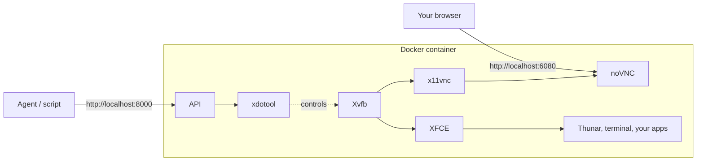

# Cursor-style VM (local Docker edition)

A local sandbox that mirrors what you see when you open the remote desktop of a
Cursor cloud agent: a clean Ubuntu 24.04 + XFCE desktop with Thunar and a dock,
accessible from your browser via noVNC, and a small HTTP automation API so any
external script or LLM can drive it. No applications are pre-installed beyond
the desktop itself: install whatever you need at runtime via `POST /shell` or
directly from the desktop.



## Requirements

- Docker Desktop with the WSL2 backend (Windows) or any Docker engine on Linux/macOS.
- ~6 GB free disk for the image, ~2 GB RAM at runtime.

## Quick start

```bash
docker compose up --build
```

Wait until you see the `Cursor-style VM is ready.` banner, then open:

- Cursor-style console (recommended): <http://localhost:3000> -- run `cd ui && npm install && npm run dev` first
- Raw desktop in browser: <http://localhost:6080/vnc.html?autoconnect=1&resize=remote&password=agent>
- Native VNC client: `localhost:5901` (password: `agent`)
- Automation API docs (Swagger UI): <http://localhost:8000/docs>

To stop and keep your home directory for next time:

```bash
docker compose down
```

To stop **and wipe** the VM (full reset to the image baseline):

```bash
docker compose down -v
```

## What's inside

| Layer | Tool |
| --- | --- |
| OS | Ubuntu 24.04 |
| Display server | Xvfb (`:1`, `1920x1080x24` by default) |
| Desktop | XFCE 4 (xfwm, xfdesktop, xfce4-panel, Thunar, Plank) |
| VNC server | x11vnc on TCP 5901 |
| Web client | noVNC + websockify on TCP 6080 |
| Apps | None preinstalled; install on demand |
| Automation | FastAPI + xdotool + scrot on TCP 8000 |

## Driving the VM from the outside

The API is documented live at <http://localhost:8000/docs>. A few cheatsheet
calls:

```bash
# Take a screenshot
curl -o screen.png http://localhost:8000/screenshot

# Move and click at (960, 540)
curl -X POST http://localhost:8000/click \
     -H 'content-type: application/json' \
     -d '{"x": 960, "y": 540}'

# Type some text
curl -X POST http://localhost:8000/type \
     -H 'content-type: application/json' \
     -d '{"text": "hello from the host"}'

# Hit a key combo
curl -X POST http://localhost:8000/key \
     -H 'content-type: application/json' \
     -d '{"keys": "ctrl+t"}'

# Launch the XFCE terminal (detached)
curl -X POST 'http://localhost:8000/launch?name=xfce4-terminal'

# Run an arbitrary shell command inside the VM (apt install, ls, ...)
curl -X POST http://localhost:8000/shell \
     -H 'content-type: application/json' \
     -d '{"cmd": "apt-get update && apt-get install -y firefox"}'
```

## Snapshots and reset

| Goal | Command |
| --- | --- |
| Soft reboot | `docker compose restart vm` |
| Reset session, keep installed apps | `docker compose down && docker compose up` |
| **Hard reset** to image baseline | `docker compose down -v` |
| Save current state as a custom snapshot | `docker commit cursor-style-vm cursor-vm:snapshot-1` |
| Start from a saved snapshot | edit `image:` in `docker-compose.yml` to `cursor-vm:snapshot-1` |

The named volume `cursor-style-vm-home` mounts at `/root`, so anything you put
in `~/Downloads`, browser profiles, etc. survives a `docker compose down`
unless you pass `-v`.

## Customising

- `SCREEN_WIDTH` / `SCREEN_HEIGHT` / `SCREEN_DEPTH` env vars (in
  `docker-compose.yml`) control the virtual screen.
- `VNC_PASSWORD` env var sets the noVNC/VNC password (default `agent`).
## Installing apps after boot

The image is intentionally bare. Two ways to add software:

```bash
# From the host, via the API
curl -X POST http://localhost:8000/shell \
     -H 'content-type: application/json' \
     -d '{"cmd":"apt-get update && apt-get install -y firefox"}'

# Or open a terminal inside the desktop and use apt directly
curl -X POST 'http://localhost:8000/launch?name=xfce4-terminal'
```

If you want a given app to be present on every fresh `down -v` reset, add the
install line to the `Dockerfile` and rebuild.

## Notes & limitations

- This image runs everything as `root`, like Cursor's reference VM. The
  isolation comes from Docker / your sandbox boundary; it is not meant to be
  exposed to untrusted networks.
- No GPU acceleration: WebGL and hardware-decoded video run in software.
- Chromium-based browsers (Chrome, Opera, etc.) need `--no-sandbox` when
  launched as root. Pass it on the command line when you start them.
- For a true microVM (Firecracker) deployment, the same Dockerfile can be
  exported to an ext4 rootfs and booted with `firecracker` or shipped to
  Fly.io Machines unchanged.

## Project layout

```text
vm/
├── Dockerfile
├── docker-compose.yml
├── .dockerignore
├── entrypoint.sh
├── README.md
├── automation/
│   ├── requirements.txt
│   └── server.py
└── ui/                       Next.js console (Cursor-style remote desktop UI)
    ├── package.json
    └── src/
```
