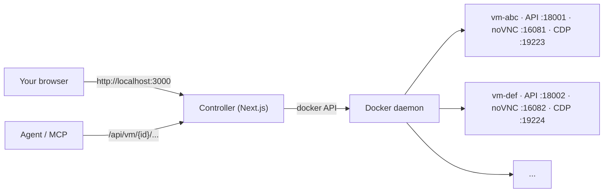
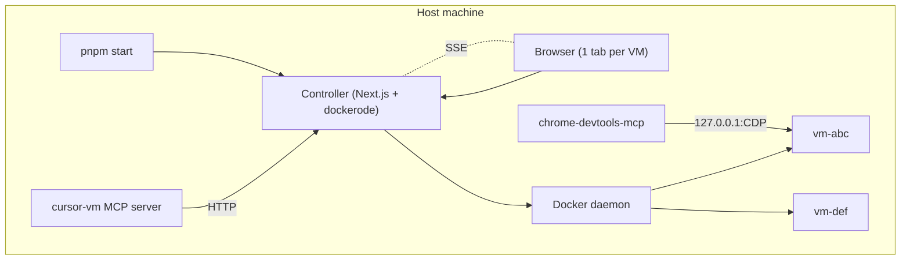

<p align="center">
  
</p>

# Cursor-style VM

> A local multi-VM sandbox: Ubuntu 24.04 + XFCE in Docker, driven from a Next.js controller and an MCP server, accessed in the browser via noVNC.


[](https://www.typescriptlang.org)


If you like this project, star it on GitHub — it helps a lot!

[Overview](#overview) • [Quick start](#quick-start) • [Inside a VM](#whats-inside-each-vm) • [Driving a VM](#driving-a-vm-from-outside) • [MCP](#driving-from-an-ai-agent-mcp) • [Config](#configuration) • [Architecture](#architecture)

## Overview

Mirrors what you see when opening the remote desktop of a Cursor cloud agent: a clean Ubuntu 24.04 + XFCE desktop with Thunar and a dock, reachable from your browser via noVNC, with a small HTTP automation API so any external script or LLM can drive it.

**One service to start, N VMs side by side.** Each VM runs in its own Docker container, with its own persistent volume, its own loopback ports for API / noVNC / CDP, and its own tab in the web console.



This repo contains three subprojects:

- **`apps/controller/`** — Next.js 16 + React 19 controller (host). Custom Node server for the noVNC WebSocket upgrade.
- **`automation/`** — FastAPI server that runs **inside** each VM container.
- **`apps/mcp-server/`** — Python MCP server that wraps the controller's HTTP API for AI agents.

The VM image (`Dockerfile`, `entrypoint.sh`, Chrome managed policies, theme assets) lives under [`vm-image/`](./vm-image) and is built automatically by the controller on first boot.

## Features

- **Multi-VM** — many isolated Ubuntu desktops side by side, each in its own browser tab.
- **Stateless controller** — Docker is the source of truth. Containers survive a controller restart and rehydrate on next boot.
- **Per-VM HTTP API** — screenshot, click, type, scroll, shell, install/uninstall, all proxied through `/api/vm/{id}/...`.
- **Loopback-only** — VM ports are bound on `127.0.0.1`, never `0.0.0.0`. Nothing leaves the host.
- **Editorial UI** — a Swiss-style noVNC console with paper backdrop, integrated shell drawer, dock, and 5-step onboarding.
- **MCP-ready** — drive every VM from an AI agent through the bundled `cursor-vm` MCP server.
- **CDP forwarding** — pop a Chrome DevTools port for any VM and point `chrome-devtools-mcp` at it.

## Requirements

- Docker Desktop with the WSL2 backend (Windows) or any Docker engine on Linux/macOS.
- Node.js ≥ 20 and `pnpm` (the controller pins `pnpm@10.33.2`).
- Python ≥ 3.10 — only if you want to run the MCP server.
- ~6 GB free disk for the VM image, ~2 GB RAM per running VM by default.

## Quick start

```bash
cd apps/controller
pnpm install
pnpm start
```

The controller validates env, builds the VM image automatically if it isn't present locally (first run only — that part takes a while), then opens on <http://localhost:3000>.

From there:

1. Click **New VM** — a fresh container spins up; the noVNC desktop appears in the first tab.
2. Click **New VM** again — a second VM in a second tab, fully isolated from the first.
3. Use the dock to take screenshots, open the integrated shell, restart the desktop session.
4. Hover a tab to delete or hard-reset that VM.

To stop the controller: `Ctrl+C`. Running VM containers survive and reappear on the next boot.

> [!TIP]
> Use `pnpm dev` instead of `pnpm start` for hot-reload during controller development. Both auto-build the VM image on first run.

## What's inside each VM

| Layer          | Tool                                                                  |
| -------------- | --------------------------------------------------------------------- |
| OS             | Ubuntu 24.04                                                          |
| Display server | Xvfb (`:1`, `1920x1080x24` by default)                                |
| Desktop        | XFCE 4 (xfwm, xfdesktop, xfce4-panel, Thunar, Plank)                  |
| VNC server     | x11vnc on container port `5901`                                       |
| Web client     | noVNC + websockify on container port `6080`                           |
| Apps           | Google Chrome (managed policies) — install more on demand             |
| Automation     | FastAPI + xdotool + scrot on container port `8000`                    |
| CDP forward    | `socat` exposing Chrome DevTools on container port `9222`             |

The controller publishes those container ports on **dynamic loopback host ports** (defaults: API `18000+`, noVNC `16080+`, CDP `19222+`). They are never bound on `0.0.0.0`.

## Driving a VM from outside

Each VM is reachable from the host via the controller proxy:

```bash
# 1. List VMs
curl http://localhost:3000/api/vms

# 2. Take a screenshot of vm `abc`
curl -o screen.png http://localhost:3000/api/vm/abc/screenshot

# 3. Click at (960, 540)
curl -X POST http://localhost:3000/api/vm/abc/click \
     -H 'content-type: application/json' \
     -d '{"x": 960, "y": 540}'

# 4. Run a shell command
curl -X POST http://localhost:3000/api/vm/abc/shell \
     -H 'content-type: application/json' \
     -d '{"cmd": "apt-get update && apt-get install -y firefox"}'
```

The full set of in-VM endpoints (the FastAPI surface from [`automation/server.py`](./automation/server.py)) is mirrored at `/api/vm/{id}/...`. Live OpenAPI docs are reachable directly on each VM via its loopback port (e.g. <http://127.0.0.1:18001/docs>).

### VM lifecycle

| Goal                                         | Endpoint                                                |
| -------------------------------------------- | ------------------------------------------------------- |
| List VMs                                     | `GET /api/vms`                                          |
| Create                                       | `POST /api/vms` — body: `{ label?, memoryMb?, cpus? }`  |
| Soft-restart container                       | `POST /api/vms/{id}/restart`                            |
| Hard reset (recreate container, keep volume) | `POST /api/vms/{id}/reset`                              |
| Hard reset + wipe volume                     | `POST /api/vms/{id}/reset?wipe=1`                       |
| Delete (and wipe volume)                     | `DELETE /api/vms/{id}?wipe=1`                           |
| Live event stream (SSE)                      | `GET /api/events`                                       |

The SSE stream republishes Docker container events filtered to `label=cursor-vm.role=vm`. The web UI subscribes to it and refreshes the VM list as soon as anything changes.

## Driving from an AI agent (MCP)

For agent-style usage (Claude Desktop, Claude Code, Cursor…), two MCP servers are wired up — distinct purposes:

- **`cursor-vm`** ([`apps/mcp-server/`](./apps/mcp-server)) — multi-VM lifecycle (`create_vm`, `delete_vm`, `reset_vm`, `list_vms`) plus per-VM desktop drive (`screenshot`, `click`, `shell`, `install_apt`, …). Every desktop tool takes an optional `vm_id`; if exactly one VM is running it's used by default.
- **`chrome-devtools`** — Google's [`chrome-devtools-mcp`](https://github.com/ChromeDevTools/chrome-devtools-mcp). Get the right host CDP port by calling `cursor-vm.launch_chrome_debug({ vm_id })` first; the result includes `host_cdp_port` and `chrome_devtools_mcp_url`. Pass that URL to `chrome-devtools-mcp` via `--browserUrl=…`.

The MCP servers config is single-sourced in [`.mcp.json`](./.mcp.json) (canonical, read by Claude Code at the repo root). After editing it, run the sync script to refresh [`.cursor/mcp.json`](./.cursor/mcp.json) (read by Cursor):

```bash
node scripts/sync-mcp.mjs
```

Both files are committed and kept byte-identical, so a single edit in `.mcp.json` is enough.

### The install / uninstall / reset loop

Uses **only `cursor-vm`**:

```text
create_vm → curl/open_url(download_url) → list_downloads → install_deb
        → screenshot → uninstall_apt → delete_vm
```

A ready-to-use Cursor skill that walks an agent through this loop is provided at [`.cursor/skills/vm-test-app-install/SKILL.md`](./.cursor/skills/vm-test-app-install/SKILL.md).

## Configuration

All env vars are validated by Zod at boot. Set them in `apps/controller/.env.local`:

| Variable                                 | Default                       | Description                          |
| ---------------------------------------- | ----------------------------- | ------------------------------------ |
| `VM_IMAGE`                               | `cursor-style-vm:latest`      | Docker image used for every VM       |
| `VM_REPO_DIR`                            | repo root (parent of `apps/`) | Build context for the image          |
| `VM_MEMORY_MB`                           | `2048`                        | RAM cap per VM                       |
| `VM_CPUS`                                | `2`                           | vCPU count per VM (fractions ok)     |
| `VM_SHM_MB`                              | `2048`                        | `/dev/shm` size (Chrome benefits)    |
| `VM_SCREEN_WIDTH` / `VM_SCREEN_HEIGHT`   | `1920` / `1080`               | Xvfb geometry                        |
| `VM_VNC_PASSWORD`                        | `agent`                       | VNC password baked into the container |
| `VM_PORT_API_BASE`                       | `18000`                       | First port of the API host pool      |
| `VM_PORT_NOVNC_BASE`                     | `16080`                       | First port of the noVNC host pool    |
| `VM_PORT_CDP_BASE`                       | `19222`                       | First port of the CDP host pool      |
| `VM_MAX_CONCURRENT`                      | `8`                           | Hard cap on concurrent VMs           |

> [!CAUTION]
> The default `VM_VNC_PASSWORD=agent` is for local-only loopback use. Change it before exposing the controller to anything beyond `127.0.0.1`.

## Architecture



<details>
<summary>Project layout</summary>

```text
vm/
├── apps/                       Host-side services
│   ├── controller/             Next.js controller (host) + UI
│   │   ├── server.ts           Custom server: HTTP + noVNC WS proxy
│   │   ├── package.json
│   │   ├── public/onboarding/  5-step editorial onboarding assets
│   │   └── src/
│   │       ├── app/
│   │       │   ├── page.tsx    Tabs shell over N VmConsoles
│   │       │   └── api/
│   │       │       ├── vms/    Lifecycle endpoints
│   │       │       ├── vm/[id]/ Per-VM HTTP proxy
│   │       │       └── events/ SSE stream of Docker events
│   │       ├── components/
│   │       └── lib/
│   │           ├── docker.ts   dockerode singleton
│   │           ├── vms.ts      VmRegistry + lifecycle
│   │           ├── ports.ts    Loopback port allocator
│   │           ├── image.ts    ensureVmImage (auto-build)
│   │           ├── schemas.ts  Zod schemas (boundary types)
│   │           ├── env.ts      Validated env
│   │           ├── vm-client.ts Per-VM HTTP client (browser)
│   │           └── useVms.ts   SWR + SSE subscription hook
│   └── mcp-server/             cursor-vm MCP server (host, multi-VM)
│       ├── requirements.txt
│       ├── server.py
│       └── README.md
├── automation/                 FastAPI server running inside each VM container
│   ├── requirements.txt
│   └── server.py
├── vm-image/                   VM image — built automatically by the controller
│   ├── Dockerfile
│   ├── entrypoint.sh
│   └── assets/
│       ├── chrome/             Managed policies + first-run prefs
│       └── theme/              XFCE / Plank / GTK theme bundle
├── scripts/
│   └── sync-mcp.mjs            Single-source MCP config sync
├── .mcp.json                   MCP servers for Claude Code (canonical)
└── .cursor/
    ├── mcp.json                MCP servers for Cursor (synced from .mcp.json)
    └── skills/
        └── vm-test-app-install/SKILL.md   Install/uninstall/delete loop skill
```

</details>

## Notes & limitations

- This image runs everything as `root`, like Cursor's reference VM. Isolation comes from Docker / your sandbox boundary; not meant to be exposed to untrusted networks.
- No GPU acceleration: WebGL and hardware-decoded video run in software.
- Chromium-based browsers (Chrome, Opera, …) need `--no-sandbox` when launched as root.
- For a true microVM (Firecracker) deployment, the same Dockerfile can be exported to an ext4 rootfs and booted with `firecracker` or shipped to Fly.io Machines unchanged. That requires Linux + KVM and is out of scope here.

## Resources

- [Next.js 16 docs](https://nextjs.org/docs) — App Router + custom server.
- [dockerode](https://github.com/apocas/dockerode) — Docker Engine API client used by the controller.
- [noVNC](https://novnc.com/info.html) — the in-browser VNC client.
- [Model Context Protocol](https://modelcontextprotocol.io/) — agent-side wire format used by `cursor-vm`.
- [`chrome-devtools-mcp`](https://github.com/ChromeDevTools/chrome-devtools-mcp) — Chrome DevTools MCP server.
