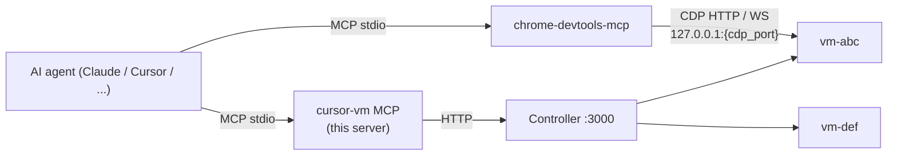

# Cursor-style VM — MCP server

An MCP (Model Context Protocol) server that lets any MCP-compatible AI agent
(Claude Desktop, Claude Code, Cursor, etc.) drive **multiple Cursor-style VMs
in parallel** via the controller's HTTP API.

## Architecture



This server runs **on the host** and only knows the controller URL. Every
desktop tool (`screenshot`, `click`, `shell`, `install_apt`, …) accepts an
optional `vm_id`. If exactly one VM is running it's used by default; with
multiple VMs the agent must specify which one.

The controller is the only service required besides Docker — it owns the
Docker daemon, builds the VM image when missing, allocates loopback ports,
and reverse-proxies every per-VM call.

## Setup

```powershell
# from the repo root
cd apps\mcp-server
python -m venv .venv
.\.venv\Scripts\Activate.ps1
pip install -r requirements.txt
```

Make sure the controller is up first:

```powershell
cd ..\controller
pnpm install
pnpm start
# → http://localhost:3000
```

## Run it standalone (sanity check)

```powershell
python server.py
```

The server speaks MCP over stdio so this just sits waiting for a client.
`Ctrl+C` to exit. Real usage is via an MCP host.

## Register with Claude Desktop

Edit `%APPDATA%\Claude\claude_desktop_config.json` and add:

```json
{
  "mcpServers": {
    "cursor-vm": {
      "command": "C:\\Users\\User\\Documents\\repository\\vm\\apps\\mcp-server\\.venv\\Scripts\\python.exe",
      "args": ["C:\\Users\\User\\Documents\\repository\\vm\\apps\\mcp-server\\server.py"],
      "env": {
        "CONTROLLER_URL": "http://localhost:3000"
      }
    }
  }
}
```

Restart Claude Desktop. The `cursor-vm` tools appear in the tool picker.

## Register with Claude Code

```powershell
claude mcp add cursor-vm `
  --env CONTROLLER_URL=http://localhost:3000 `
  -- C:\Users\User\Documents\repository\vm\apps\mcp-server\.venv\Scripts\python.exe `
     C:\Users\User\Documents\repository\vm\apps\mcp-server\server.py
```

## Environment variables

| Var              | Default                  | Purpose                                |
| ---------------- | ------------------------ | -------------------------------------- |
| `CONTROLLER_URL` | `http://localhost:3000`  | Where the Next.js controller listens   |

## Tool reference

### Lifecycle (controller-level, no `vm_id` needed)

- `list_vms()` — returns every VM the controller knows about
- `create_vm(label?, memory_mb?, cpus?)` — spin up a fresh container
- `delete_vm(vm_id, wipe=True)` — stop + remove container, drop volume
- `reset_vm(vm_id, wipe=True)` — recreate container, optionally wipe volume
- `restart_vm(vm_id)` — soft restart (keeps volume)

### Vision / meta (per-VM)

- `health(vm_id?)` — the in-VM API is up
- `screen_size(vm_id?)` — desktop dimensions
- `cursor_position(vm_id?)` — current mouse coords
- `list_windows(vm_id?)` — open windows (id, desktop, title)
- `screenshot(vm_id?)` — PNG of the desktop

### Mouse / keyboard (per-VM)

- `move_mouse(x, y, vm_id?)`
- `click(x, y, button="left", clicks=1, vm_id?)`
- `double_click(x, y, vm_id?)`
- `right_click(x, y, vm_id?)`
- `scroll(x, y, direction="down", amount=3, vm_id?)`
- `drag(from_x, from_y, to_x, to_y, button="left", vm_id?)`
- `type_text(text, delay_ms=12, vm_id?)`
- `press_key(keys, repeat=1, vm_id?)` — xdotool syntax (`ctrl+t`, `Return`, `alt+F4`)

### System (per-VM)

- `shell(cmd, timeout=60, vm_id?)` — arbitrary shell inside the VM
- `launch_app(name, vm_id?)` — launch a detached desktop app

### Chrome / install / uninstall (per-VM)

- `open_url(url, vm_id?)` — open in Chrome (`--no-sandbox` is set automatically)
- `launch_chrome_debug(url=None, vm_id?)` — launch Chrome with the DevTools
  Protocol exposed. Returns `{ host_cdp_port, chrome_devtools_mcp_url, ... }`
  so you can point `chrome-devtools-mcp` at the right port.
- `kill_chrome(vm_id?)` — force-quit Chrome
- `list_downloads(vm_id?)` — `ls -la /root/Downloads`
- `install_apt(package, update=true, vm_id?)`
- `install_deb(deb_path, vm_id?)`
- `uninstall_apt(package, purge=true, autoremove=true, vm_id?)`
- `list_installed(filter_substr=None, vm_id?)`

## Project-scoped MCP registration (`.mcp.json`)

The repo ships a `.mcp.json` at the root that registers both servers for
Claude Code in project scope. Open the repo, accept the project servers
once, and both `cursor-vm` and `chrome-devtools` are immediately available.

Note: `chrome-devtools-mcp` is no longer pre-pointed at a fixed
`http://127.0.0.1:9222`. Each VM has its own CDP host port — call
`cursor-vm.launch_chrome_debug({ vm_id })` to discover it, then either
restart the chrome-devtools MCP with `--browserUrl=...` or use the smoke
test below as a template.

## Typical loop the agent would run

Uses **only `cursor-vm`** (chrome-devtools-mcp is unrelated):

1. `cursor-vm.create_vm({ label: "test" })` — fresh sandbox
2. Trigger the download:
   - first try `cursor-vm.shell({ vm_id, cmd: "cd /root/Downloads && curl -fL -O -J <url>" })`
   - if the URL needs a real browser, `cursor-vm.open_url({ vm_id, url })`,
     read a `cursor-vm.screenshot({ vm_id })` and click on the download
     button
3. Poll `cursor-vm.list_downloads({ vm_id })` until the installer file appears
4. `cursor-vm.install_deb({ vm_id, deb_path: "/root/Downloads/<file>" })`
5. `cursor-vm.launch_app({ vm_id, name: "opera --no-sandbox" })` +
   `cursor-vm.screenshot({ vm_id })`
6. `cursor-vm.uninstall_apt({ vm_id, package: "opera-stable" })`
7. `cursor-vm.delete_vm({ vm_id, wipe: true })` and start the next case

A Cursor skill that walks through this loop is provided at
[`.cursor/skills/vm-test-app-install/SKILL.md`](../../.cursor/skills/vm-test-app-install/SKILL.md).

## Smoke tests

Run from the repo root once the controller is up (`cd apps\controller && pnpm start`):

```powershell
# cursor-vm itself: creates a VM, exercises desktop/system tools, deletes it
.\apps\mcp-server\.venv\Scripts\python.exe apps\mcp-server\smoke_test_cursor_vm.py

# chrome-devtools-mcp -> Chrome inside one of the VMs (creates one if needed,
# launches Chrome with CDP, then drives chrome-devtools-mcp at the per-VM
# host port)
.\apps\mcp-server\.venv\Scripts\python.exe apps\mcp-server\smoke_test_cdm.py
```
